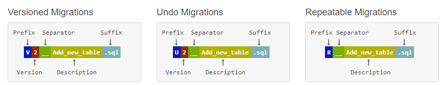
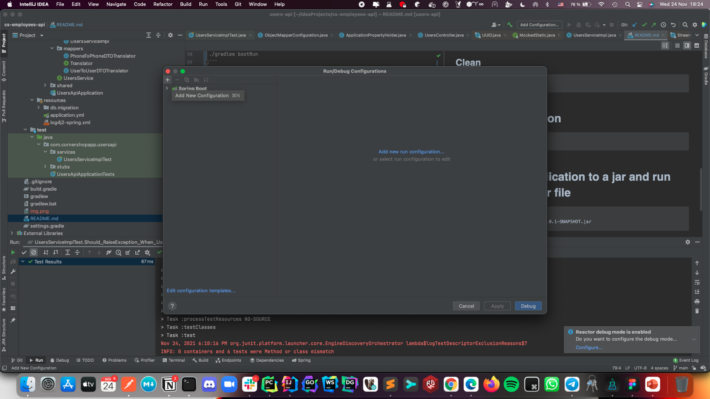
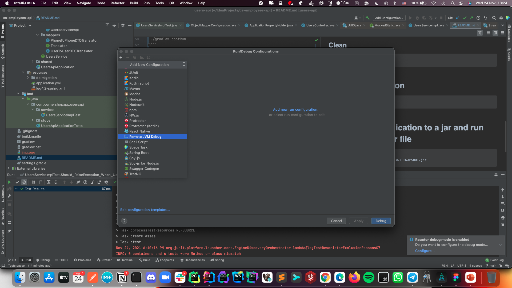
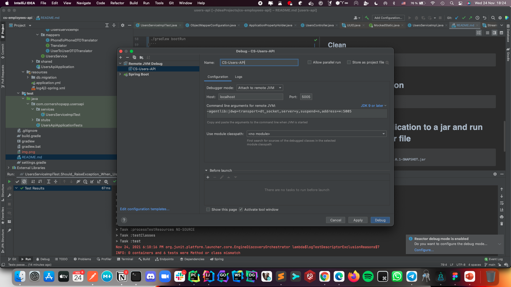

# cs-users-api

This projects has the following dependencies:

- Java 16
- MySql (installed via homebrew)
- Gradle
- IntelliJ (community edition should be enough maybe 🤔)
- FlyWay to handle the migrations

# Java 16

You can download the installer from the [Oracle Archive page](https://www.oracle.com/java/technologies/javase/jdk16-archive-downloads.html#license-lightbox) 

# MySql

```
brew install mysql
```

## Launch mysql

```
mysql.server start 
```

## Stop mysql

```
mysql.server stop 
```

# Gradle

This project contains a wrapper provided via ``gradlew``

# Migrations

Migrations have to follow this naming convention to use FlyWay:



## Run

```
gradle flywayMigrate -i
```

## Clean

```
gradle flywayClear -i
```

# Run the application

```
./gradlew bootRun
```

# Package the application to a jar and run that generated jar file

```
./gradlew bootJar
java -jar build/libs/users-api-0.0.1-SNAPSHOT.jar
```

# Debug the application

```
 ./gradlew bootRun --debug-jvm
```

Then add a remote debugger on IntelliJ:

1. Go to Run Menu
2. Go to Debug
3. Edit configurations







# Sample Requests

## Create one user

```curl
curl --location --request POST 'http://localhost:8080/api/users' \
--header 'Content-Type: application/json' \
--data-raw '{
    "first_name": "Ale",
    "last_name": "Fernandez",
    "email": "ale.fernandez@cornershopapp.com"
}'
```

## Get all users

```curl
curl -X GET http://localhost:8080/api/users
```


## Get user by id

```curl
curl -X GET http://localhost:8080/api/users/1
```

# Run tests

1. You could do it from IntelliJ doing right-click over ``/src/test/java`` -> "Run tests in ..."
2. From the terminal by running: ``./gradlew test``
